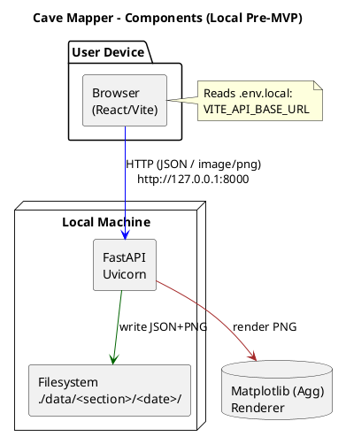
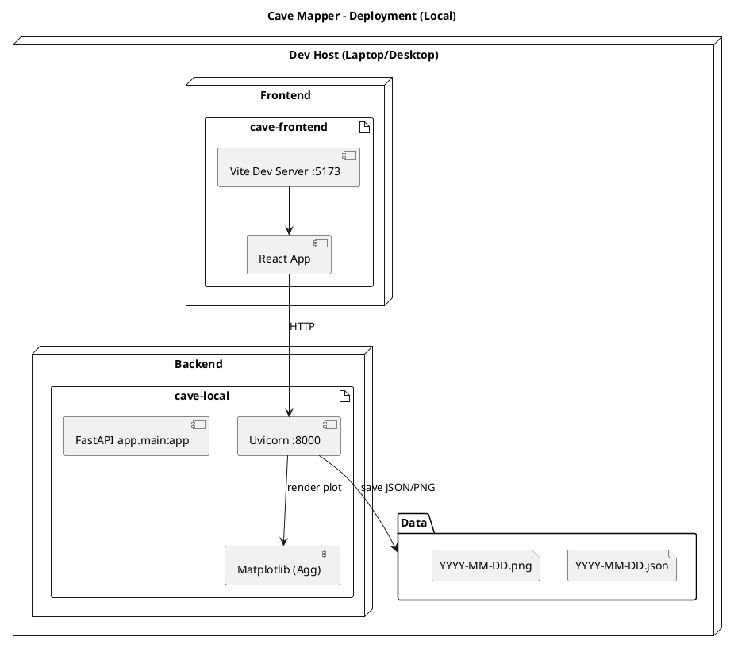
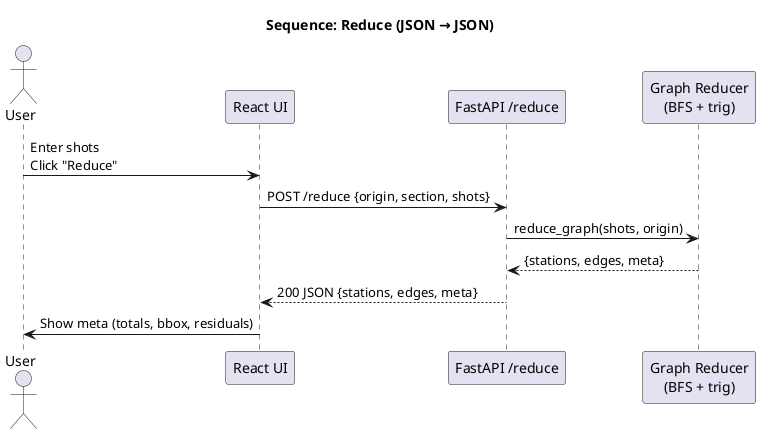
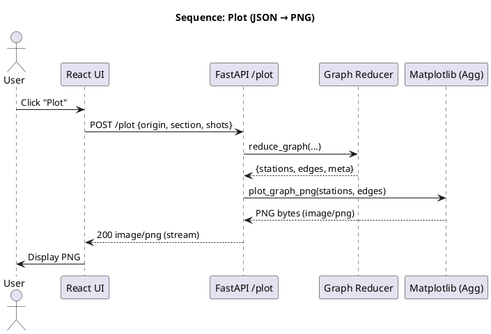
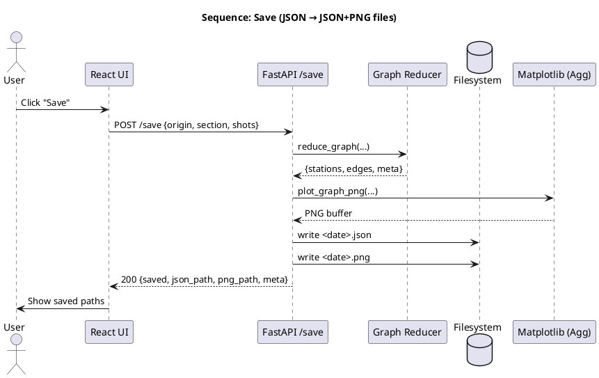
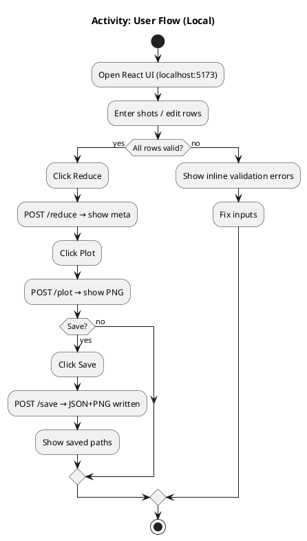
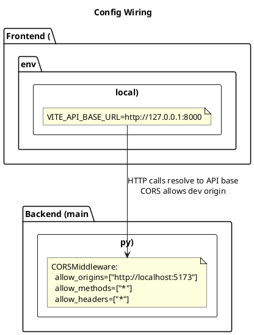

**single self-contained file** `documentation/pre-mvp.md`.
It includes the **explanatory documentation** and all the **PlantUML diagrams** (as fenced `plantuml` code blocks) in one place.

---

# Cave Mapper — Pre-MVP (Local) Documentation & Diagrams

This document describes the local pre-MVP for a cave survey reducer and line-plot visualizer. It includes architecture, components, sequences, data flows, commands, and PlantUML diagrams.

---

## 1) Overview

A local, two-tier app for reducing cave survey shots to XYZ coordinates and visualizing plan-view linework.

* **Frontend**: React (Vite) UI for data entry, validation, reduce/plot/save actions.
* **Backend**: FastAPI endpoints for trig reduction, graph traversal (branches/loops), PNG rendering, and JSON/PNG autosave to `./data/…`.
* **Data model**: Stations as nodes, shots as directed edges; reduction is BFS over the graph, with loop residuals reported.

---

## 2) Architecture (components view)



---

## 3) Deployment view



---

## 4) Sequence — Reduce (happy path)



---

## 5) Sequence — Plot (JSON → PNG)



---

## 6) Sequence — Save (JSON → files)



---

## 7) Data model (schema & derived)

```plantuml
@startuml
title Data Model (Request/Response & Derived)

class TraverseIn {
  +origin_x: float = 0
  +origin_y: float = 0
  +origin_z: float = 0
  +section: str = "default"
  +shots: Shot[1..*]
  +close: str?  // reserved ("bowditch")
}

class Shot {
  +from_station: str
  +to_station: str
  +slope_distance: float (>0)
  +azimuth_deg: float [0..360)
  +inclination_deg: float [-90..90]
}

class ReduceResponse {
  +stations: Map<str, XYZ>
  +edges: List<[str,str]>
  +meta: Meta
}

class XYZ { +x: float +y: float +z: float }
class Meta {
  +num_stations: int
  +num_shots: int
  +total_slope_distance: float
  +total_horizontal_distance: float
  +bbox: BBox
  +residuals: Residual[0..*]
}
class BBox { +min_x +max_x +min_y +max_y +min_z +max_z : float }
class Residual { +from: str +to: str +dx +dy +dz: float }

TraverseIn "1" o-- "1..*" Shot
ReduceResponse "1" o-- "1" Meta
ReduceResponse "1" o-- "0..*" XYZ
ReduceResponse "1" o-- "0..*" BBox
Meta "1" o-- "0..*" Residual

@enduml
```

---

## 8) Activity — User Flow (Local)



---

## 9) CORS & Env wiring



---

## 10) Local environment setup

### Backend (FastAPI)

```
cave-local/
├─ app/
│  ├─ __init__.py
│  └─ main.py
├─ requirements.txt
└─ data/
```

**requirements.txt**

```
fastapi
uvicorn[standard]
pydantic>=2
numpy
matplotlib
python-multipart
```

**Create & activate venv; install deps**

```bash
cd cave-local
python3 -m venv .venv
source .venv/bin/activate
pip install -r requirements.txt
```

**Run backend**

```bash
uvicorn app.main:app --reload
# http://127.0.0.1:8000/  and  /docs
```

### Frontend (React with Vite)

```
cave-frontend/
├─ src/
│  ├─ App.jsx
│  └─ api.js
├─ package.json
└─ .env.local
```

**Node (nvm)**

```bash
nvm install 22
nvm use 22
node -v   # v22.x
npm -v
```

**.env.local**

```
VITE_API_BASE_URL=http://127.0.0.1:8000
```

**Install & run**

```bash
cd cave-frontend
npm install
npm run dev
# http://localhost:5173
```

---

## 11) Browser usage (frontend)

* Enter shots; inputs enforce:

  * Distance > 0
  * Azimuth normalized to \[0, 360)
  * Inclination clamped to \[-90, 90]
* **Reduce** → display totals/bbox/residuals
* **Plot** → display PNG
* **Save** → JSON+PNG in `./data/<section>/<date>/`

**Quick test shots**

* `(S0→S1, 10m, az=0, inc=0)` → north 10m (Y+=10)
* `(S1→S2, 10m, az=90, inc=0)` → east 10m (X+=10)
* Side passage example: `(S1→S3, 8m, az=180, inc=0)`

---

## 12) Command-line tips

**Health**

```bash
curl http://127.0.0.1:8000/
```

**Swagger**

```
http://127.0.0.1:8000/docs
```

**Kill dev servers (if needed)**

```bash
pkill -f uvicorn
pkill -f vite
```

**Check ports**

```bash
lsof -i :8000
lsof -i :5173
```

---

## 13) Math conventions

* **Azimuth**: clockwise from North (0°=North, 90°=East).
* **Inclination**: +up / −down (degrees).
* **Per-shot deltas**:

  ```
  horiz = slope * cos(inc)
  dz    = slope * sin(inc)
  dx    = horiz * sin(az)   # East (X)
  dy    = horiz * cos(az)   # North (Y)
  ```
* **Graph reduction**:

  * BFS from origin station
  * Branches render naturally (multiple edges from a station)
  * Loop/tie-ins produce residuals (reported in meta)

---

## 14) UAT (User Acceptance Testing) checklist

**Preparation**

* Known test datasets: straight line, rectangle loop, branch from mid-station.
* Define acceptance criteria (distance totals, residual tolerance, file outputs).

**Execution**

1. Enter dataset A → Reduce → confirm totals.
2. Plot → confirm geometry and labels.
3. Save → verify JSON & PNG paths, open both.
4. Enter dataset B with a side passage → plot shows both branches.
5. Enter invalid values → UI shows errors; backend returns 422.

**Pass criteria**

* Correct geometry & metadata; files created & readable; validation messages clear.

---

## 15) Next steps (when ready)

* **UX polish**: scale bar, north arrow, title, label density control, color by “series”.
* **Data import**: CSV → JSON schema; “Paste JSON” dialog.
* **Adjustment**: Bowditch toggle; (later) least squares with backsight weighting.
* **Cloud POC**:

  * Backend → Render (Uvicorn start)
  * Frontend → Netlify/Vercel (Vite build)
  * Files → S3 (swap local writes in `/save` with `boto3` uploads)
  * CORS: allow deployed frontend origin
* **Auth**: public “data entry only” vs authenticated “view/download”.

---

**End of file.**
